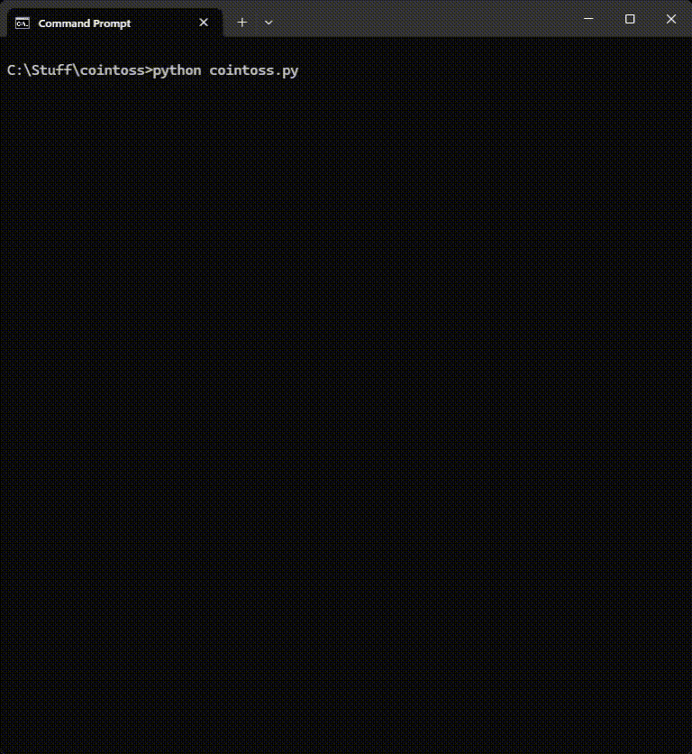
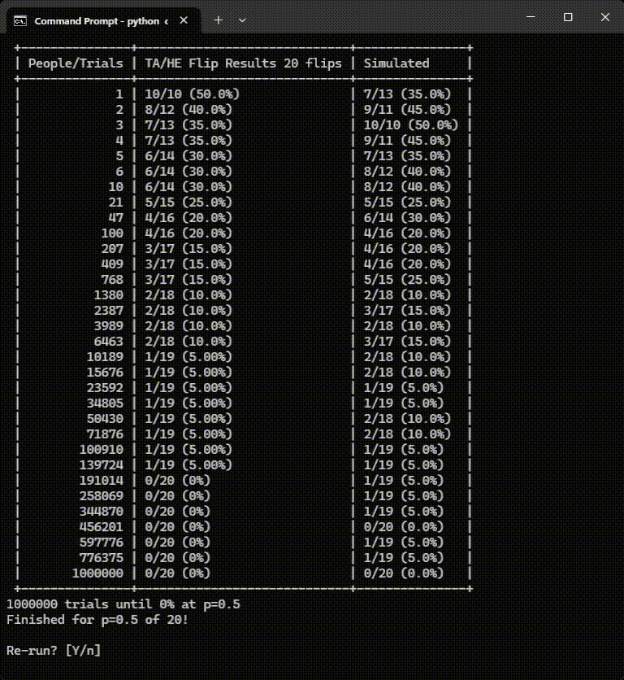

# Hello World

This program was conceived, researched, and somewhat haphazardly programmed just before the pandemic in early 2020. Aside from adding command line options, I haven't continued development on it because other repositories and the usual, but I wish to when time is available.

# What is it?

A college level mathematics teacher will tell you to calculate the number of trials for a cointoss before we get all heads or all tails, we simply do 2^(trials). This is the reduction of the binomial distribution formula.

The most concise explanation I can give is:

**So, if we flip 5 coins (trials), it will take 2^5 i.e. 32 total cointosses, whether we assign to multiple people, or done by one to achieve a streak of all 5 heads or all 5 tails.**

***Yet, there is still a nonzero possibilty of getting all heads/tails (or close to) when looking at 2^(trials - x) where x is the gap before we reach 2^(trials). So, if we cycle through x from a logarithmic or linear series of numbers this program will show those nonzero probabilities, and their level.***

Protip: Only simulate tosses when attempting to confirm validity of the predictive algorthim, it will take forever to simulate trials in other cases.

## But, how do we calculate that?

A statistican would have some great ideas. I am not one, I am a math hobbyist that is just interested in this particular corner of academics, and this is my result. 

# Inspiration

If you have a roomful of people performing a cointoss, what are the expected breakdowns of "streaks" to occur respective to not only the number of cointosses, but the number of rooms performing the trial?

If you'd like to understand what algorithm underlies the code, and why I chose it, please message me and we can chat, but it's in fact very basic. The accuracy is not 100%, but it seems to be scalable so I think it's most likely on the correct track.

# Example

Sorry for the blinking - didn't really want to get into all the nuance of terminal cursor position on a multi-platform level. It tends to not be an issue when running it as fast calculations go fast, and longer calculations has less blinking.

This first example is of 10,000 coin tosses. It can surprisingly quickly predict what multiplier (People/Trials) needs to be performed to get at least one instance of, what most people would consider, a low probability result, and the next column HE/TA shows what that result will be. Consider the second column could have been displayed in reverse, so if you take 10,000 in this case and your result is 4400 heads / 5600 tails, it is true that this is the same as getting at least one 5600 heads / 4400 result.

This next example is the same, but now we choose a lower number (in this case 20) because we're simulating them, and it takes a long time, but allows one to get some sense of the first example's accuracy as well as understand that real world results will vary.

## Improvements?

The first thing on my mind is getting to run with pypy for faster runtimes and simulations. But, we could work on QRNG sources. Right now it is set to a RNG that is for security encryption, with the idea that it could be more "random." (And, it does appear to be that way, from my experimentation.)

## The Point?

When the population of a probability exceeds a certain amount the gaussian distribution isn't as seemingly accurate anymore because the long tails of a distribution suddenly allow extended runs of wins / losses. In the past this was fine because computers couldn't calculate those tails timely due to factorial equations being difficult to solve for, but now computers have advanced enough to accomodate complex factorial equations to some extent.
